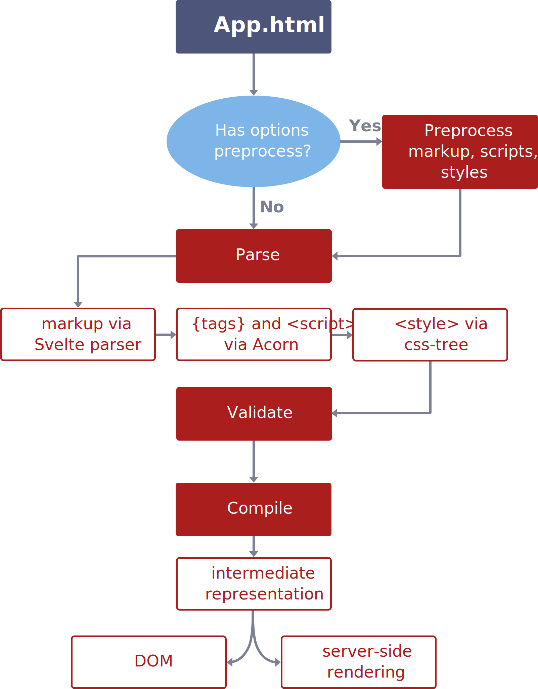
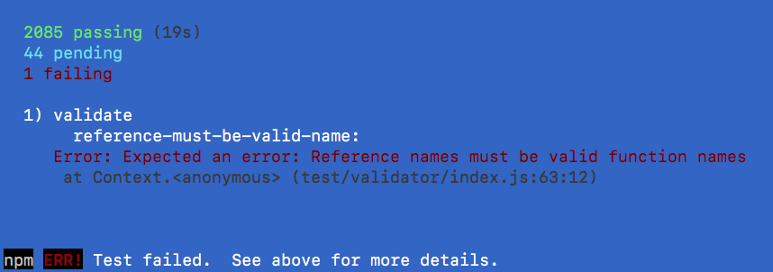

### First time contributors

#### Finding square one

Wtih a large codebase, especially one for a compiler, it's challenging to know where to start contributing. The first step is to check out the [issues page](https://github.com/sveltejs/svelte/issues) for Svelte. It's recommended to skim through some of the `Bug` labeled issues to see if any grab your attention. As of now, we don't have a label for first time contributors but a `First Time Contributor` label is being discussed to be included in the triage of issues.

#### What stage causes my error?

So you've selected an issue that could be good for a first PR, now what? We need to find out where the code causing the error shows up. First step will be finding out what stage in the compilation process handles the domain of our error.

From here we can start to dig into `src/parse`, `src/validate`, or `src/compile` to see what code could contain clues on where the error is originating. This compile time flow diagram will give you an idea of how code in `App.html` gets compiled.



#### Replicate the bug with a failing test

One of the best places to start diving into the Svelte codebase is the test directory. Here we can see there are plenty of tests for a multitude of errors. We want to make a new test that fails the way we're expecting it to. 

*Words can only help so much so let's do an example.*

Say we have a bug where assigning `ref:foo-bar` is invalid but not throwing a useful error, it's outputting "Assigining to rvalue".

How do we replicate this? First we suspect that it occurs in the `Validate` block so let's make a new test in `test/validator/samples`. We'll name it `reference-must-be-valid-name`. Check out the various folders in the various `samples` directories to get a good idea of how to name your folders. 

What do we put in our new folder? Each test folder contains an `errors.json` and an `input.html`. First off, `input.html` is the easier of the two files to make, we just need to use the same code that generated the error in our Svelte REPL!

**Input.html**
```html
<div ref:foo-bar>
</div>

<style>
	ref:foo-bar {
		display: flex;
	}
</style>
```

First let's take a look at the `errors.json` file and then work through the various parts.

**errors.json**
```json
[{
  "message": "Reference name 'foo-bar' is invalid — must be a valid identifier such as foo_bar",
  "start": {
    "line": 1,
    "column": 5,
    "character": 5 
  },
  "end": {
    "line": 1,
    "column": 16,
    "character": 16
  },
  "pos": 5,
  "code": "invalid-reference-name"
}]
```

**message** - The value associated with the message on the error that gets thrown.

**start** - The location of the cursor at the start of the code causing the error. 

**end** - The location of the cursor at the end of the code causing the error.

**pos** - The start position in characters instead of lines or columns.

**code** - The specific code associated with the error that gets thrown.

`start` and `end` are hard to determine strictly by looking at your `input.html` code, so sometimes you have to use feedback from `npm run test` to refine those values.

`message` and `code` are specified in your fix, so when you throw this new error you can choose the message and code. It's recommended to check out other errors with their messages and codes to get an idea of how to structure yours.

#### Running the failing test

Now that we have our folder for the test, we want to try running the test.

A quick peek in `package.json` tells us that there is a "test" script so let's run `npm run test` and
see what happens:



Sweet! We have a failing test. However we don't need to be running all 2000+ tests when we're only focused on this one test. We can change our folder name from `reference-must-be-valid-name` to `reference-must-be-valid-name.solo` in order to only run our test.

#### Adding our new fix!

We have our failing test and now we want to make it pass.

This where a good deal of work will take place. As a first time contributor digging around the codebase will be your new hobby. However, we have a leg up since we suspect it's a validation based bug. Immediately we start digging into `src/validate/` and see it's split up into `html`, `js`, and `utils`.


Since we're dealing with the code chunk `<div ref:foo-bar></div>` we can be confident in looking into the `html` first.

.

Great! Looks like we're getting closer to the source of the error. Our first suspicion should be that our fix will need to go in `validateComponent.ts` since we're validating on the component. (Spoiler: we're also going to need to add the code to `validateElement.ts`).

In `validateComponent.ts` we find a conditional regarding an attribute's type being "Ref". 

```js
if (attribute.type === 'Ref') {
  if (!refs.has(attribute.name)) refs.set(attribute.name, []);
  refs.get(attribute.name).push(node);
}
```

Looks like there's no check for determining valid names, so let's go ahead and add that. It just so happens that there's a utility function `isValidIdentifier` in `src/validate/utils/` that we can use to determine if our reference's name is valid. We can now find another place where this function is used to see if we can see how others have utilized this function.

In `src/validate/js/propValidators/computed.ts` we see the function being used for what looks to be the same reason! 


```js
if (!isValidIdentifier(name)) {
  const suggestion = name.replace(/[^_$a-z0-9]/ig, '_').replace(/^\d/, '_$&');
  validator.error(computation.key, {
    code: `invalid-computed-name`,
    message: `Computed property name '${name}' is invalid — must be a valid identifier such as ${suggestion}`
  });
}
```

Now we can add a similar code block to our `validateComponent.ts` (and subsequently `validateElement.ts`).

```js
if (attribute.type === 'Ref') {
  if (!isValidIdentifier(attribute.name)) {
    const suggestion = attribute.name.replace(/[^_$a-z0-9]/ig, '_').replace(/^\d/, '_$&');
    
    validator.error(attribute, {
      code: `invalid-reference-name`,
      message: `Reference name '${attribute.name}' is invalid — must be a valid identifier such as ${suggestion}`
    });	
  } else {
    if (!refs.has(attribute.name)) refs.set(attribute.name, []);
    refs.get(attribute.name).push(node);
  }
}
```

Running `npm run test` again we can see we now have a passing test. Following standards, we can make our commits and then make a pull request for our new fix.

All that's left to do is eagerly await feedback and do it all over again!